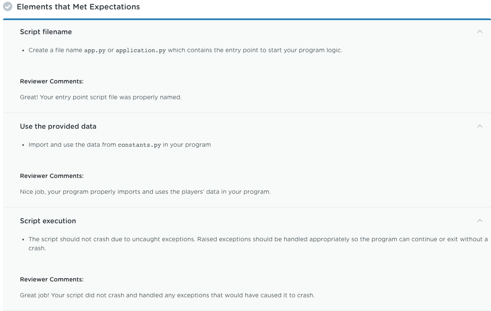
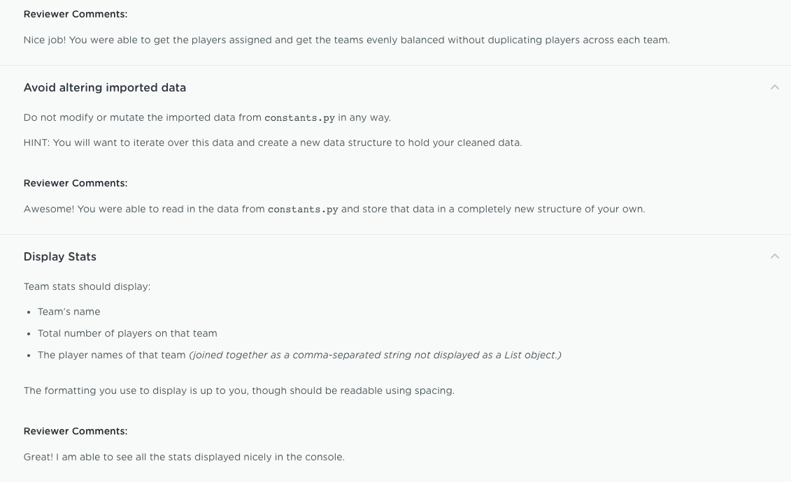

# Unit-2-Basketball-Stats-Tool
Built a console-based program where I applied my knowledge of built-in Python data types and combine these types to create structures to store and organize a team of Basketball players into distributed teams. This tool will not only balance the teams by the total number of players but also let me generate some statistics for a given team.

***Project Instructions***

***Project Output***

***Project review feedback***

